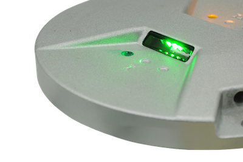

# Follow the Greens

## How it Works

First, the plugin tries to guess the airport from your current plane location.
If the plugin fails to guess the airport, you will have to manually enter the airport ICAO code.
If it cannot find the airport in your scenery folder, it says so and terminates.

Second, the plugin checks its requirements, mainly the network of taxiways.
If it fails to find a network of taxiways, it reports so and terminates.

Third, the plugin tries to guess if you are departing or arriving from your position,
and prompt for either a ramp name for arrival or a runway for departure.
If it guessed wrong for departure/arrival there is a button to switch between the two.

To select your destination, first click inside the input text box to set focus there, then you can use
UP and DOWN arrow keys to cycle through proposed valid destinations.
If you hit a text key or a number key, selection jumps to the first matching destination.

Once you selected your destination,
if the plugin fails to find a route to your desired destination on the network of taxiways,
it says so and unfortunately terminates.
The plane must be within 1/4 mile of the taxiway.

So if it complains that it cannot find a route to your destination, move a bit closer to taxiway
network and try again.

Otherwise, you're all set. Just " Follow the greens ". The plug in will tell you in which direction
you should head to reach the first taxiway leg.

If you missed a turn, just ask a new "green path" and the plugin will re-route you.

When reaching a stop bar (red lights across the taxiway), you must stop and ask for clearance.
The plugin will prompt you to tell it when you received clearance.
Since this plugin does not make any ATC, you have to ask for the clearance yourself to GROUND.
Once cleared, simply press the "Clearance Received" button and the plug in will light the next
leg of green to your destination.

A final popup will tell you when you reached your destination.

The main Follow the greens window hides itself after a fe seconds. Simply select the menu entry
to reveal it again.


The orignal Follow the greens system does not have a rabbit running in front of the plane.
However, I witnessed it when taxiing at Dubaï airport on a foggy morning. We could clearly
see the rabbit with the camera in the nose of the plane (777). (Could a pilot confirm this,
or may be a Dubai ground controller?) I found it a nice addition anyway.

The plugin ecologically turns light off as soon as you don't need them anymore,
thereby restoring precious resources to X-Plane.


## Help Appreciated

I appreciate some help for the following refinements.

1. Adjustment of lights. (I could not create LIGHT_PARAM with datarefs.)
Adjust brightness and/or on-off through datarefs. (I currenlty use very bright red and green lights.)
I could not create a "rabbit beacon" of lights in front of the plane.
I currently program the rabbitby turning lights on and off in a flightloop.
Making a beacon light managed by x-plane will probably be more durable and efficient (?).

I'd love to place the lights on decorated lines (where X-Plane places its taxiway lights)
rather than on taxiway routing network (more "gross"). I'm busy smoothing this network of lines
to make smoother turns.


BTW: With a little hiccup on start (to find your airport and load its network of taxiway)
and for route computation and light instanciation, Follow the greens is FPS friendly.
Rabbit runs about 2 to 10 times a second, and plane position is adjusted every 10 seconds or so.
All these parameters are globals and can be adjusted to your need, preferences, or requirements.
You usually taxi at reasonably slow speed, FPS is not as critical as when approaching.

2. Routing: Sometimes, the "closest" taxiway leg is behind you. It is not acceptable for plane to U-Turn to reach it.
Plugin uses naive Dijkstra, taking very limited things into account. There is definitively room for improvement there.
For exemple, find a route without crossing any runway, rather than the shortest path.
The plugin search a connection to taxiways in front of the plane, but if none can be found, you may have to U-turn.

Airport time, wind, and other approach constraints are not taken into consideration.
You must tell your desired destination manually.

3. Interaction with ATC.
I'd love to interact with an ATC of some sort, to light or clear stop bars when necessary.
Currently, it's all done manually.


Code is on github. Feel free to bring your own enhancements.


I hope you will enjoy the eye candy Follow the greens.


Taxi safely.

## Lights

I struggle with X-Plane lights.

```
# Light repeated to make it brighter
# NAME             X   Y   Z    R   G   B   A   size <s1> <t1> <s2> <t2> dataref
LIGHT_CUSTOM       0   0   0    0.1 1.0 0.1 1   0.3  0.0  0.5  0.5  0.0  UNUSED
```

The size of the light (0.3) is relative (to what?) and is already quite large, but visible.
Smaller lights (0.2) are OK but smaller, and less bright.

To augment luminosity, the last line is sometimes repeated 10, or 20 times!
Feel free to experiment to your liking.



## Light Illumination

In a future release, if this does not take too much a toll on X-Plane fps,
I like to illuminate light _progressively_, not instanteneous on/off light.

## Wish

Dear Laminar,

Rather than artificial yellow "coach" arrows to show the way to taxi,
would it be possible to provide a killing eye candy "Follow the greens"?

Follow the greens is a fairly recent Advanced Surface Movement Guidance and Control System (A-SMGCS).
It is used at a couple of the busiest airports.
In other words, that system do exist.

As far as realism goes, let's say that the simplest local muni airfield can now have "Follow the greens",
provided it has a network of taxi route.
But brighter taxiway centerline lights is not as artifical as the yellow coach arrows.
Following the green works in all weather and day time conditions.

I have seen this in action (Dubai airport, arrival with heavy fog, camera in the nose of the plane.)
All taxilights were lit, the pilot was shown the way to follow with a rabbit of a few taxiway centerline lights (about 3-6 lights, fairly fast and dynamic rabbit).
It was awesome to see. Please search for "Follow the greens" and look at a few videos.

Thanks a lot for X-Plane. We have a lot of fun.
Keep it open, so we can add our fantasies to your world.

Best regards.

# See Also

[ATC Taxi Layouts](https://developer.x-plane.com/2012/01/atc-taxi-layouts/)

[Correctly Forming Taxiways and Junctions](https://developer.x-plane.com/article/correctly-forming-taxiways-and-junctions/)

[ATC Taxi Route Authoring](https://developer.x-plane.com/article/atc-taxi-route-authoring/)

[Airport Data (apt.dat) 12.00 File Format Specification](https://developer.x-plane.com/article/airport-data-apt-dat-12-00-file-format-specification/)
