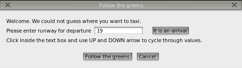

# Follow the Greens

Follow the greens is a enhancement to airport infrastructure to ease ground operations.

It is an aid for ground movement, to indicate to pilots where and how to circulate on taxiways without ATC communication.

ATC Ground operators will highlight the taxi path the pilot has to follow with center taxiway green lights.
A red line across the taxiway indicates the aircraft has to hold and wait for the red light to clear.
Very much like car traffic lights.

No more path or taxiway segment names to remember. Just green lights to follow.

Follow the greens is part of the serious _Advanced Surface Movement Guidance and Control System_ (A-SMGCS).

Please have a look at the [following video](https://vimeo.com/101564135) and search for "airport Follow the greens" to get more information.
[http://followthegreens.com](http://followthegreens.com) if you are interested.
There is nowadays a lot more information, manufacturers, and experimental project reports to learn from.

Follow the greens has numerous advantages discussed in the above videos, ranking to ease of use, to smoother taxi rides,
to lower interaction with ground control.

Yeah, yeah, less fuel use also.

Yeah, yeah, less CO~2~ produced.

Yeah, yeah, follow the greens is realllly green. Can't be greener than that.

Seriously. No green bashing.

I found amusing to bring Follow the greens concept to X-Plane as ATC and "AI" struggle to guide you on the ground.
X-Plane yellow painted coach arrows on taxiways are fine, useful, but look too artificial.

Follow the greens is an existing system used at a handful airports.
But now, thanks to this plugin, even your local muni can get Follow the greens _(at no cost)_.

Follow the greens is abbreviated FtG.


# Installation

Release 2 will not work on X-Plkane 11.

FtG plugin is written in the python language.
Therefore, you first need to install the [XPPython3 plugin](https://xppython3.readthedocs.io/en/latest/).

This process is very similar to the Lua language plugin (XLua or FlyithLua) to use Lua scripts.
Here, another language (Python), another plugin (XPPython3).

For the Release 2 of FtG, Version 4 of the XPPython3 plugin is required.
Newer version of XPPython3 contain all you need to run Python plugin, including a version of the python language interpreter.
There is no need to install other software.

Once XPPython3 plugin is installed, plugins written in the python language are located in

```
<X-Plane 12 Folder> / resources / plugins / PythonPlugins
```

(The XPPython3 plugin itself resides in `<X-Plane 12 Folder> / resources / plugins / XPPython3` folder,
but you should not touch that folder content in any way.)

Download the FtG plugin code and unzip it.

Place both the file `PI_Followthegreens.py` and the folder `followthegreens` in `<X-Plane 12 Folder> / resources / plugins / PythonPlugins`.

That's it.

Reload X-Plane, or the plugins, or the python scripts and you are all set.

When X-Plane is running and a plane is loaded, check the _Plugin_ menu item at the top.
It should now contain a _Follow the greens..._ menu item.


# Usage

To use Follow the greens at an airport facility, there is a little constrain on the airport:
It must have a network of taxiways defined in its airport X-Plane file.
Most airports do.

If an airport does not have a network of taxiways defined in X-Plane,
Follow the greens will tell you so and terminate.

To start follow the greens, you will need to supply some information to it to start.

If you are at a stand location, ready for departure, you will need to supply the runway you are taking-off from.
Follow the greens will light the path the the entrane of the runway.



If you just landed and roll out, heading for your stand, you will need to supply the stand number.
It must be a stand location known from X-Plane for that airport.
Follow the greens will light the way to the stand.


If you added plugins like [AutoDGS](https://forums.x-plane.org/forums/topic/290222-autodgs-dgs-marshaller-or-vdgs-for-every-gateway-airport/#comment-2569544), you will be guided at the stand by a marshall or a VDG system.

If your path come across an holding position, FtG will indicate the holding position with a red bar of lights
across the taxiway.

When approaching this red line across the taxiway, a dialog box will pop up and ask you to confirm
when you received the clearance to progress.

Follow the greens is not aware of the ATC ground in use, and the ATC ground is not aware of the existance of FtG.
Therefore, when ATC has given clearance and you aknowledged it, you can press the the «Clearance received» button
in the dialog box.


Follow the greens will resume, turn off the red lights and light the next segment of greens.

It will do so until you reach your destination.

That is it. Nothing more. Nothing less.


# New in Release 2

Release 2 no longer works on X-Plane 11 because of the use of new X-Plane SDK API calls and XPPython3 simplifications.

XPPython3 release 4 or above is required.


# Rationale for Release 2

After reading [this paper](https://www.sciencedirect.com/science/article/pii/S0968090X19311404),
I found it amusing to incorporate their model and suggestions into FtG.

Please notice the « overhype » with _4D_ trajectories 🤣.

FtG 1 is 2D (latitude and longitude guidance on the ground...), FtG 2 adds time information to get you there on time, that’s just a third dimension.
FtG won’t ask you to fly to your holding position.
(🤔 we may here have a definite path for improvement in a future release.)

Nowadays you know, you don’t sell anything if it does not have AI or 4D in its name.
FtG 2.0 is therefore 4D compliant, with `altitude=0` all the way.
There is absolutely not AI, just HFAB (human fun and bugs).

If you’re rather safely go through your pre-takeoff checklist while taxiing,
gently blow the daffodils on the sides of the taxiway with warm air,
take your time to get to the runway, you can stick with Release 1.

But if you want to maximise your air time, never loose time in those unnecessary long runs around the airport,
if you’d rather taxi at just below _v~r~_ speed, give Release 2 a try.
And monitor your brakes temperature.


## Runway Light Control

While FtG rabbit runs, all runway lights are dimmed to a preference value:

`RUNWAY_LIGHT_LEVEL_WHILE_FTG`

So if you set it to

```
RUNWAY_LIGHT_LEVEL_WHILE_FTG = AMBIANT_RWY_LIGHT.LOW
```

all runway lights will be dimmed to low while FtG is running.
Even completely OFF if you choose to do so.

Runway light luminosity will be restored to its original value after FtG terminates.

Alternatively, independently of FtG, runway lights can be dimmed thanks to following X-Plane commands:

- `sim/operation/rwy_lights_off` (sim/graphics/scenery/airport_light_level=0)
- `sim/operation/rwy_lights_lo` (sim/graphics/scenery/airport_light_level=0.25)
- `sim/operation/rwy_lights_med` (sim/graphics/scenery/airport_light_level=0.5)
- `sim/operation/rwy_lights_hi` (sim/graphics/scenery/airport_light_level=1)


## Rabbit Speed

The speed and length of the rabbit can be controlled by two preference parameters:

```
RABBIT_LENGTH = 10  # number of lights that blink in front of aircraft
RABBIT_DURATION = 0.2  # sec duration of "off" light in rabbit
```

You can manually adjust rabbit speed and length with the following FtG commands:

- `XPPython3/followthegreens/speed_slow` (length x 2, speed x 2)
- `XPPython3/followthegreens/speed_slower` (normal length, speed x 2, twice slower)
- `XPPython3/followthegreens/speed_med` (normal length, normal speed)
- `XPPython3/followthegreens/speed_faster` (normal length, speed / 2, twice faster)
- `XPPython3/followthegreens/speed_fast` (length x 2, speed / 2)


## Automagic Rabbit Speed Control

The goal of Release 2 is to supply taxi speed information to the pilot in addition to the direction (Follow the greens).
The speed information is supplied with two «variables»:

- The speed of the «rabbit» (the faster the rabbit, the faster you should run to catch it up, the slower the rabbit, the slower you should go.)
- The length of the rabbit run (the longer the rabbit, the more you can keep up with that speed, do not expect speed change.)


In this first instance, the control of the speed is simplified as such:

From the position of the aircraft and the distance to the next significan turn, a speed range is evaluated.

- If the aircraft is at or below the lowest range speed, the rabbit will propose to accelerate (run faster). This is indicated by a faster rabbit sequence.
- If the aircraft is at or above the upper range speed, the rabbit will propose to slow down. This is indicated by a slower rabbit sequence.
- If the aircraft nears a stop bar or the end of the greens (at about 200 meters from it), the rabbit will also propose to slow down.

If the aircraft moves at a speed within its estimated range, the rabbit will run at normal speed.

There currently is no difference between a GA and a A380. They all taxi at the same speed range.

In a later release, speed indication will be refined to anticipate turns (at slow speed) or long, straight taxiways.
Speeds will also be adjusted for aircraft types, weight, and sizes.
Braking distance will be estimeted from the current speed and aircraft type.


# Configuration Parameters

Configuration file is either

`<X-Plane 12 Folder> / Resources / plugins / PythonPlugins / followthegreens / ftgconfig.toml`

or

`<X-Plane 12 Folder> / Output / preferences / ftgconfig.toml`

```
DISTANCE_BETWEEN_GREEN_LIGHTS = 20  # meters
DISTANCE_BETWEEN_LIGHTS = 40  # meters

LIGHTS_AHEAD = 0   # number of green lights
RABBIT_LENGTH = 10   # number of green lights
RABBIT_DURATION = 0.2   # seconds, no less than 0.1

RUNWAY_LIGHT_LEVEL_WHILE_FTG = "lo"  # off, lo, med, hi
```


Please note that the values you enter here may degrade X-Plane performances (faster rabbit, numerous taxiway lights...)
The plugin enforces certain constraints to prevent X-Plane from crashing.

# Notes on Performances

Follow the greens uses little resources.

1. Every 10 seconds or so, FtG checks the aircraft position and speed and adjust greens accordingly.
2. The rabbit is called more often, depending on its speed. The faster the rabbit, the more pressure on X-Plane. With 0.2 seconds rabbit, FtG is unnoticable.

One might expect a slight hiccup when looking for a route at a large airport with numerous taxiways.
Hiccup should not last more than one or two seconds in this case.

### About Strict Route Search Mode

The goal of FtG is to provide a route from where the aircraft is located to a destination,
either a runway entry, or a parking stand.
It does this by finding a route on a network of taxiways.

But!

Taxiways may have contraints.

First, there might be aircraft size/width/weight constraints. A narrow taxiway is not suitable for an airliner.
Second, there might be local constrainst like one-way taxiways, taxiways used for inner/outer traffic.
Third, runways may sometime be used as taxiways, usually with a U-turn facility at its edges.

X-Plane airport designer sometimes provides detailed taxiway information, sometimes not.

Follow the greens has to cope with what is available in airport definition files.


# FtG Control and Monitoring

FtG adds the follwoing commands:

- `XPPython3/followthegreens/main_windown_toggle`
- `XPPython3/followthegreens/send_clearance_ok`
- `XPPython3/followthegreens/send_cancel`
- `XPPython3/followthegreens/send_ok`
- `XPPython3/followthegreens/highlight_taxiways_toggle`


FtG adds the following dataref:

- `XPPython3/followthegreens/is_running`

which is 0 if FtG is not running and 1 when FtG is running.


# Developer Notes

See [developer notes](devnotes.md).

[Changelog](changelog.md)

