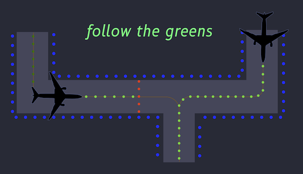
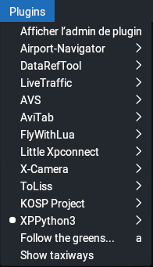
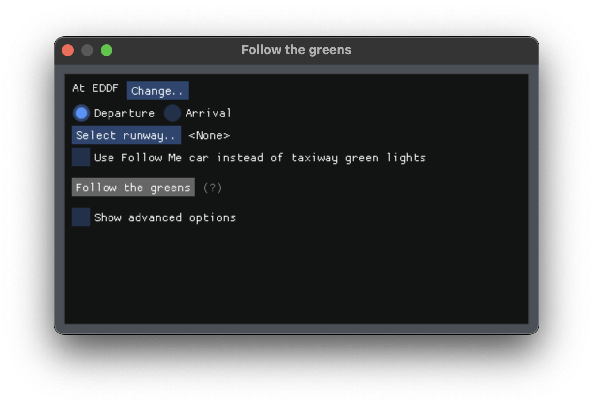
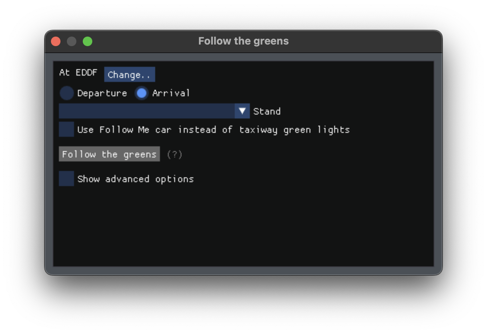
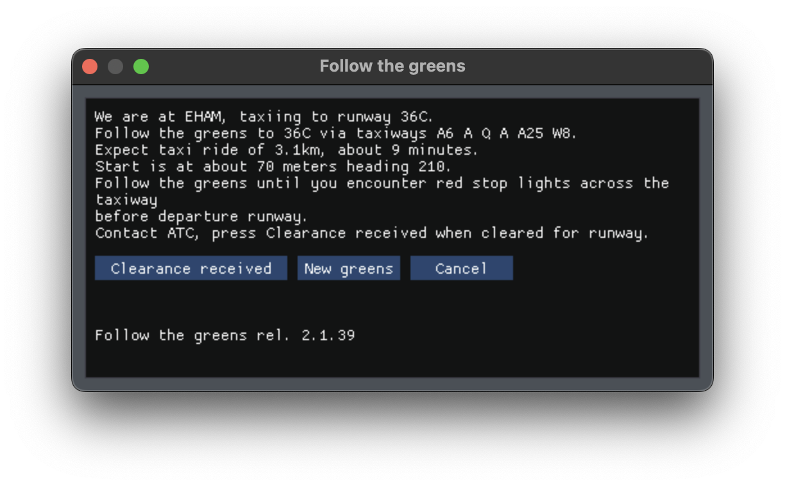
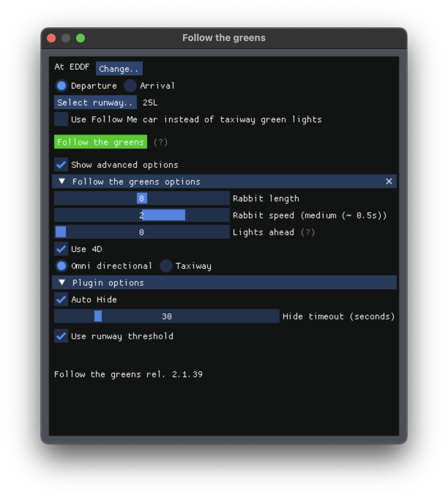
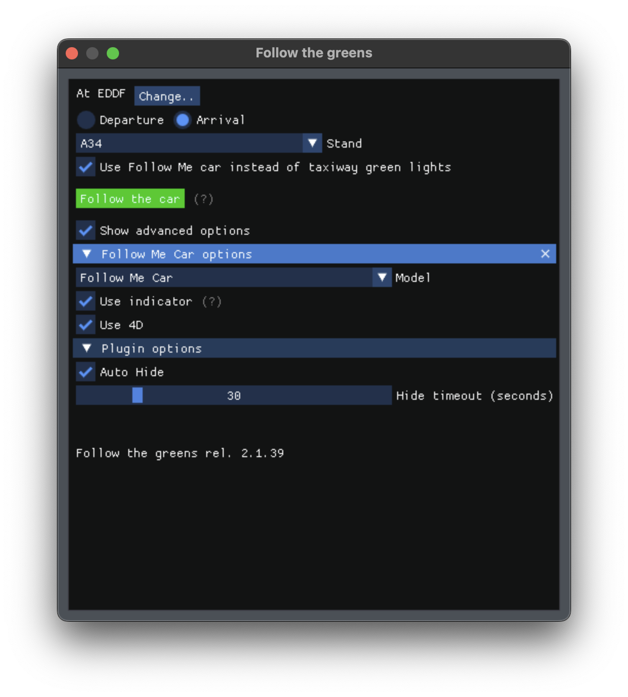

# Follow the Greens

Welcome to the Follow the greens / Follow the car  X-Plane Plugin.

 - What is Follow the greens?
 - Installation of the plugin
 - Usage
 - Options
 - X-Dispatch
 - Advanced options and preferences


## What is Follow the greens?

Follow the greens is a enhancement to airport infrastructure to ease ground operations.

It is an aid for ground movement, to indicate to pilots where and how to circulate on taxiways without ATC communication.

ATC Ground operators will highlight the taxi path the pilot has to follow with center taxiway green lights.
A red line across the taxiway indicates the aircraft has to hold and wait for the red light to clear.
Very much like car traffic lights.



No more path or taxiway segment names to remember. Just green lights to follow.

Follow the greens is part of the serious _Advanced Surface Movement Guidance and Control System_
(A-SMGCS, See [here](https://tm3airports.com/asmgcs-design/) if interested).

Please have a look at the following videos and search for
« [airport follow the greens](https://duckduckgo.com/?t=ffab&q=airport+follow+the+greens&ia=web) »
to get more information.
There is nowadays a lot more information,
there are a lot more manufacturers, and experimental project reports to learn from.

- [Follow the greens](https://vimeo.com/101564135)
- [ATRiCS TowerPad](https://vimeo.com/88129469)
- [More video](https://m.youtube.com/watch?v=LOWvHemtOaQ)
- [More video](https://www.youtube.com/watch?v=zNxPpeESsGI)
- [More video](https://www.youtube.com/watch?v=zAn1mfBDDkc)
- [More video](https://vimeo.com/88132688)

You'll find more videos through the search link above.

Follow the greens has numerous advantages discussed in the above videos, ranking to ease of use, to smoother taxi rides,
to lower interaction with ground control.

Yeah, yeah, less fuel use also.
Yeah, yeah, less CO~2~ produced.
Yeah, yeah, follow the greens is realllly green.
Can't be greener than that. No green bashing.

We brought Follow the greens concept to X-Plane as ATC and "AI" struggle to guide you on the ground.
X-Plane yellow painted coach arrows on taxiways are fine, useful, but look too artificial.

Follow the greens is an existing system used at a handful airports.
But now, thanks to this plugin, even your local muni can get Follow the greens _(at no cost)_.


### What is Follow the greens « 4D »?

Follow the greens 4D is an enhancement to the basic Follow the greens.

After reading [this paper](https://www.sciencedirect.com/science/article/pii/S0968090X19311404),
We decided to incorporate their proposal into FtG.

In a nutshell, FtG will now monitor your taxi speed and invite you to adjust it.
It will do so by adjusting the speed of the «rabbit» light in front of the aircraft,
(the pulsating light,)
and the length of the rabbit run.
If the rabbit runs fast and far, you can safely accelerate your taxi pace.
If the rabbit is slow and short, you must reduce your speed because you are probably nearing a sharp turn or a mandatory stop.

Could it be simpler?

Follow the greens.

Try to catch the rabbit.

## Installation

Newer releases (2 or above) will not work on X-Plane 11.
If you want to use Follow the greens on X-Plane 11, you have to use [Release 1](https://github.com/devleaks/followthegreens/releases/tag/1.7.0).

FtG plugin is written in the python language.
Therefore, you first need to install the [XPPython3 plugin](https://xppython3.readthedocs.io/en/latest/).
This process is very similar to the Lua language plugin (XLua or FlyithLua) to use Lua scripts.
Here, another language (Python), another plugin (XPPython3).

For the Release 2 of FtG, Version 4.5 or above of the XPPython3 plugin is required.
Newer version of XPPython3 contain all you need to run Python plugin, including a version of the python language interpreter.
There is no need to install other software.

Once XPPython3 plugin is installed, python plugin scripts are placed in

```
<X-Plane 12 Folder> / resources / plugins / PythonPlugins
```

[Download the FtG plugin code](https://github.com/devleaks/followthegreens/releases) and unzip it.

Place both file `PI_Followthegreens.py` and folder `followthegreens` in `<X-Plane 12 Folder> / resources / plugins / PythonPlugins`.

That's it.

Reload X-Plane, or the plugins, or the python scripts and you are all set.

When X-Plane is running and a plane is loaded, check the _Plugins_ menu item at the top.
It should now contain a _Follow the greens..._ menu item.




After installation, the structure of X-Plane folders should ressemble something like this:

```
<X-Plane 12>
    /Resources
        /plugins
            /PythonPlugins
                PI_FollowTheGreens.py
                /followthegreens
                    /lights (light objects library)
```


## Usage

To use Follow the greens at an airport facility, there is a little constrain on the airport:
It must have a network of taxiways defined in its airport X-Plane file.
Most airports do.
If an airport does not have a network of taxiways defined in X-Plane,
Follow the greens will tell you so and terminate.

To start follow the greens, you will need to supply some information.

If you are at a stand location, ready for departure, you will need to supply the runway you are taking-off from.
Follow the greens will light the path to the entrance of the runway.



If you just landed and roll out, heading for your stand, you will need to supply the stand number.
It must be a stand location known from X-Plane for that airport.
Follow the greens will light the way to the stand.



If your path come across an holding position, FtG will indicate the holding position with a red bar of lights
across the taxiway.

When approaching this red line across the taxiway, a dialog box will pop up and ask you to confirm
when you received the clearance to progress.

Follow the greens is not aware of the ATC ground in use, and the ATC ground is not aware of the existance of FtG.
Therefore, when ATC has given clearance and you aknowledged it, you can press the the «Clearance received» button
in the dialog box.



Follow the greens will resume, turn off the red lights and light the next segment of greens.

It will do so until you reach your destination.

That is it. Nothing more. Nothing less.


## Options


### Follow the greens Options




#### Rabbit Length

Number of pulsating lights in front of the aircraft.

In normal condition, this is computed from the desired length of the pulsating light in front of the aircraft
(which defaults to twice the length of the aircraft) and the distance between lights.


#### Rabbit Speed

This is the speed at which lights are pulsating in front of the aircraft.

When adjusted through « 4D », lights will be pulsating twice as fast or twice as slower when necessary.


#### Lights Ahead

Number of lights after the pulsating lights.

 - 0 light ahead means all lights in front of the rabbit will be lit.
 - _n_ lights ahead means _n_ lights will be added after the rabbit.


To have no lights ahead of the rabbit, you have to add at least one light in front of the rabbit
which is unnoticable.


#### Taxiway Light Types

Follow the greens can either use an artificial, highly visible omni-directional light,
or a more realistyic taxiway light, only visible if aligned with the taxiway.

In both cases, a taxiway light is placed on the ground and always visible, whether lit or not.
Also, the intensity of the light is adjusted automatically depending on the environmental condtions
(night, fog...) and can be adjusted through preferences.


### Follow Me Car Options




#### Follow Me Car Model

Follow the greens offers 2 Follow Me car models, courtesy of X-CSL team.

Other models can be provided and used through the preference system.


#### Indicator

The _Indicator_ is a signboard on top of the car.
If present, it will display textual instruction on top of the follow me car like `TURN >>>` or `! STOP !`,
in addition to the `FOLLOW ME`.

##### Note

Technically speaking...

The _Indicator_ is a separate, autonomous object that can be added to other Follow Me Car models.
It can be added through the preference system.
It can even be used autonomously, like a floating signboard on top of a Back-to-the-future hover board!


### General Options

#### Interface auto-hide

Follow the greens interface is meant to disappear after a few seconds of non-use.
It will automatically re-appear when needed (clearance requested, etc.).

If the use prefers to leave the user interface visible, auto-hide can be supressed.
If auto-hide is selected, the number of second before the interface disappears can
be adjusted between 10 seconds and 2 minutes.


## X-Dispatch

[X-dispatch](https://x-dispatch.app) is a comprehensive spectacular flight dispatching application
that allows you to plan and prepare your flight and then launch X-Plane to execute your flight.

X-dispatch allows for taxi planning on both departure and arrival.
When planning the taxi ride, route can either be automatic (route finding), or manual.
The manual planning allows to draw an arbitrary taxi path on the ground of the airport.
The resulting taxi route is saved into a file.

If that file is available, Follow the greens will read that file 
and highlight the taxi route provided by X-dispatch,
whether is was automatically computed or manually drawn.


## Advanced Options and Preferences

[See here](preferences.md).


## In case of Misbehavior...

[See here](troubleshooting.md).


Taxi safely