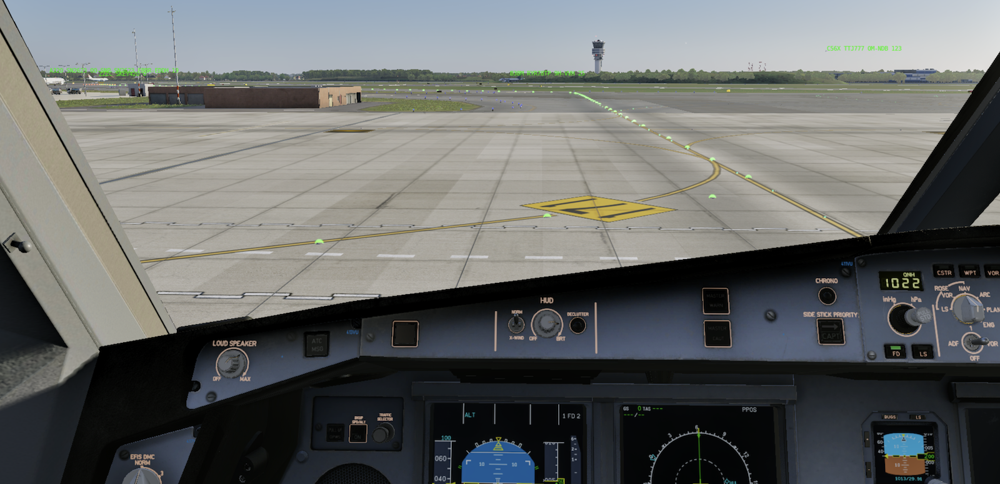
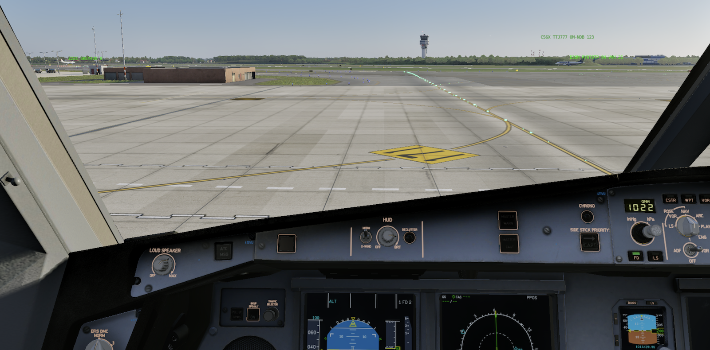
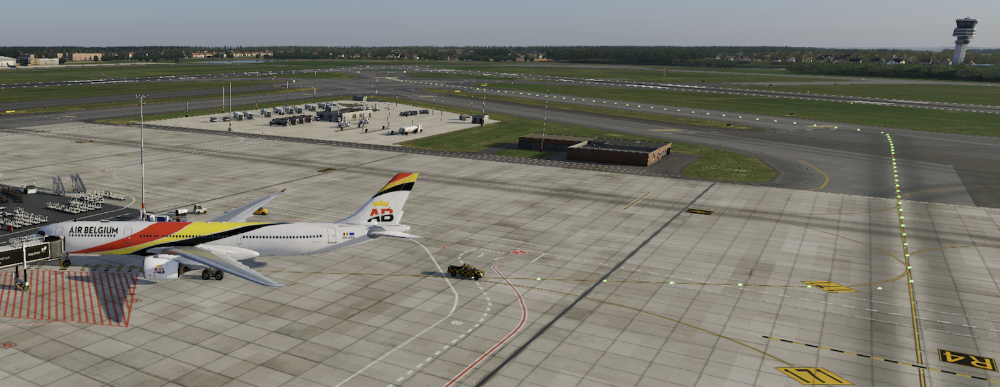
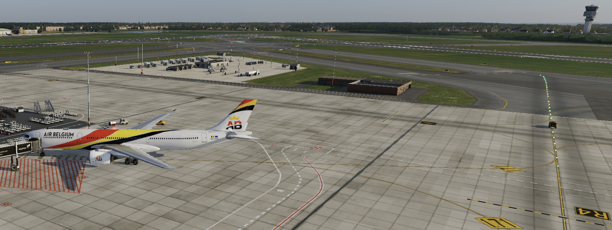

# Follow the Greens Advanced Preference Set up

A number of FtG parameters are exposed as _Preferences_.
It means that changing the value of a preference will modify the behavior and aspect of FtG.

*Please recall that setting inappropriate values may cause FtG to malfunction,
degrade X-Plane overall performances, even make X-Plane crash in some circumstances.*

Fortunately, most of these preference settings are reversible.
Just suppress misbehaving preferences and FtG will fall back on its green lights.


# How Preference Works

Preferences are loaded each time a new FtG guidance session is started.

The preference file is located in:

`<X-Plane 12 Folder> / Output / preferences / followthegreens.prf`

If the file is not found, there won't be any preference set up.
FtG will create an empty file at that location for later use.

If a preference file is found, loaded preferences are logged in the ftg_log.txt file.
It is then easy to control which values are being used in the application.


## Preference Raffinements

FtG provides a value for each preference.
If the value of a preference is not found in the file,
FtG will use its _default_ value.

Preference can be specified at several "levels":

- Global level, for the entire application,
- Airport level, only applicable at a specific airport,
- Aircraft level, only application to a class of aircraft, or at an aircraft type level.

Some preferences only exists at the _global level_ and cannot be further adjusted.
They are application level preferences.
Example of such preference is the `DISTANCE_BETWEEN_STOPLIGHTS`.

Some other preferences can be set at the global level, but also at the airport level,
or the aircraft type level.

Example of such preference is the length of the rabbit light (pulsating light)
in front of the aircraft: `RABBIT_LENGTH`.

THe idea for _airport-level_ values adjustment is realism.
There are different realization of Follow the greens.
Some airport may have green light paths, but no rabbit.
Some other airport may only have a short rabbit and no light ahead.
(Both exists.)

The idea for _aircraft-level_ values is practical.
For some aircraft types, the generic value is inappropriate.
Pilots of large aircraft may appreciate a longer rabbit run, and more light ahead
than the number provided by default to anticipate route and turns.
A pilot of a general aviation aircraft will not see the rabbit light 300 meter ahead.
This is why FtG allows for aircraft type specific value set, for the confort of the pilot.

A preference set at a specific level (airport, aircraft) has precedence
over a preference set at the global, application-level.


# Global Preferences

Global preferences are set at the highest level and apply to the entire FtG system.
These following preferences can be adjusted at the global level
but cannot be adjusted at a particular level:

1. DISTANCE_BETWEEN_STOPLIGHTS (in meters, a small distance like 1 (dense) to 3 (loose) meters.)
1. ADD_WIGWAG: Adds a «wigwag» light on the side of stop bar if the stop bar is guarding a runway.


# Airport Preferences

Airports may have particular setup for FtG.
The following preferences can be set at an individual airport level:

1. `DISTANCE_BETWEEN_GREEN_LIGHTS`: Distance between taxiway center lights (expressed in meters.)
1. `RABBIT_SPEED`: Rabbit speed, including completely disabled by setting the speed to `0`. (Expressed in fraction of a second; would be the same for all aicrafts.)
1. `RABBIT_LENGTH`: Rabbit length (would be the same for all aicrafts.)
1. `DISTANCE_BETWEEN_LIGHTS`: Distance between lights when illuminating the whole taxiway network (Show taxiway, expressed in meters.).

To adjust preferences for a precise airport, use the following snippet.
Please notice the use of the airport ICAO code in the preference section part (called a TOML table section).

```
[Airports.EBBR]
DISTANCE_BETWEEN_GREEN_LIGHTS = 8  # meters
RABBIT_SPEED = 0.2  # seconds

[Airports.EHAM]
LIGHTS_AHEAD = 100  # meters
RABBIT_LENGTH = 100  # meters
DISTANCE_BETWEEN_GREEN_LIGHTS = 12  # meters
```


# Aircraft Preferences

The following preferences are set depending on the detected aircraft type:

1. Rabbit speed
1. Rabbit length
1. (Static) lights ahead of the rabbit

To adjust aircraft preferences, length must be expressed "physically", with metric units:

For example, for a 40 meter aircraft (A320, B737), rabbit length should be 80m in front of the aircraft,
and lights ahead another 50 meters ahead of the rabbit.

The reason to express aircraft requirements in physical units is that the number of lights
to be used for the rabbit is dependent on other paramters like the distance between lights,
a parameter that may vary from airport to airport, and is not related to an aircraft.

It is possible to adjust the preferences for an entire aircraft category (class `A` to `F`),
or for a specific aircraft ICOA identifier.

```
[Aircrafts.C]
LIGHTS_AHEAD = 100  # meters
RABBIT_LENGTH = 150  # meters
RABBIT_SPEED = 0.20  # seconds

[Aircrafts.A339]
LIGHTS_AHEAD = 200  # meters
RABBIT_LENGTH = 200  # meters
RABBIT_SPEED = 0.20  # seconds
```


# Summary

Table summary with preference, where the preference is supplied,
and units used for the preference.

| Preference                    | Global        | Airport          | Aircraft Class   | Aircraft Type    |
| ----------------------------- | ------------- | ---------------- | ---------------- | ---------------- |
| TOML «TABLE»                  |               | [Airport.ICAO]   | [Aircraft.C]     | [Aircraft.ICAO]  |
| ----------------------------- | ------------- | ---------------- | ---------------- | ---------------- |
| LIGHTS_AHEAD                  | # lights      | distance(meters) | distance(meters) | distance(meters) |
| RABBIT_LENGTH                 | # lights      | distance(meters) | distance(meters) | distance(meters) |
| RABBIT_SPEED                  | seconds       | seconds          | seconds          | seconds          |
| RUNWAY_LIGHT_LEVEL_WHILE_FTG  | lo,med,hi,off | lo,med,hi,off    | NA               | NA               |
| DISTANCE_BETWEEN_GREEN_LIGHTS | meters        | meters           | NA               | NA               |
| DISTANCE_BETWEEN_LIGHTS       | meters        | meters           | NA               | NA               |
| DISTANCE_BETWEEN_STOPLIGHTS   | meters        | meters           | NA               | NA               |

See above code snippets for examples.


# Strict Route Search Mode

The goal of FtG is to provide a route from where the aircraft is located to a destination,
either a runway entry, or a parking stand.
It does this by finding a route on a network of taxiways.

However, taxiways may have contraints:

1. Aircraft size/width/weight constraints. A narrow taxiway is not suitable for an airliner.
2. Local constrainst like one-way taxiways, taxiways used for inner/outer traffic.
3. Runways may sometime be used as taxiways, usually with a U-turn surface at its ends.

The algorithm first tries to find a route respecting all constraints.
If no route is found, the algorith will relax some constraints, one by one until a route is found.

If you do not want to respect taxiway constraints, please set the following preference parameter:

```
RESPECT_CONSTRAINTS = false
```

Recall that Follow the greens does not optimisation.
It finds the shortest path, respecting constraints if possible.
The shortest path is .. the shortest.
It is not the path with the less turn, or the more logical path, it is the shortest.


# Lights

FtG lights different _types of lights_ at precise locations.
You can adjust some of the light parameters to change the size, color, and intensity of each _type of light_.

The different types of lights are:

- `FIRST`: First light of follow the greens.
- `TAXIWAY`: Regular "green" taxiway light used for the path and the "rabbit".
- `TAXIWAY_ALT`: On runway lead-on and lead-off, same as TAXIWAY light but yellow/amber.
- `STOP`: Lights used to build the stop bar across the taxiway when clearance is requested (same as TAXIWAY light but red.).
- `VERTEX`: Additional light added at taxiway network vertex, as published in the airport data file. Used for development mainly.
- `WARNING`: Additional light, no longer used, a yellow taxiway light.
- `LAST`: Last light of follow the greens.
- `ACTIVE`: Light on a departure, arrival or ILS active segment.
- `DEFAULT`: Light used by Show Taxiway to illuminate all taxiways, default to a bright white light.

To change lights parameters for a type of light, insert the following preference:

```
[Lights.TAXIWAY_ALT]
color = [1.0, 1.0, 0.0]  # (r, g, b), values in [0, 1] range
intensity = 20  # default value
size = 20  # default value
```

This would change the `TAXIWAY_ALT` light type to a bright yellow light.
(The above preference will effectively _create_ a new light with a random name with the supplied paramters and load it.)


## Light Appearance

FtG uses two types of light.

The *default light* is a simple, spheric, omni directional light.
It can be configured using the parameters:

- Color
- Size
- Intensity

To create a normal, default light with specific color, size and intensity,
you can use the code snippet above.


The *realistic light* is a more complex light that has the appearance and behavior of common taxiway lights.
Light is directional, aligned with the taxiway, and can only be seen when facing it.
It is more realistic, at the expense of being more difficult to see if not properly aligned.
The standard realistic light has twice the brightness of a regular taxiway light
and stand out in both daylight and night lights.




On the above pictures, please notice how lights are visible or not,
as seen sideway, on the forefront or after the first turn.

Realistic lights only have two parameters:

- Color, which must by a code g (green), r (red), y (yellow/amber), as provided by X-Plane, no other color possible.
- Intensity, an integer number that replicate the same light at the same position making it brighter.

The intensity is therefore a integer number that tells how many copies of the light must be placed.

To create a realistic light, you can use the following snippet:

```
[Lights.TAXIWAY_ALT]
taxiway = "r:2"
```

would create a realistic taxiway RED light with double light intensity.


Finally, note that FtG lights, standard or realistic,
are NOT affected by the `sim/graphics/scenery/airport_light_level` dataref
that sets the overall intensity of runway lights.





## Alternate Light Object File

To use another object light, you must use the following syntax:

```
Lights.TAXIWAY_ALT = "path/to/personal-object-light.obj"
```

It is not the same as

```
[Lights.TAXIWAY_ALT]
name = "path/to/personal-object-light.obj"
```

which would _create_ a file named `path/to/personal-object-light.obj`
with default custom light values (color=white, intensity=20, size=20)
as explained above.

Path objects are relative to the `followthegreens` folder.


## Taxiway Light Objects

The above light "objects" are in fact just lights.
They have no object representing them on the screen on a rendering.
They are just LIGHTS.

So, to be complete, there is an extra light type

- `OFF`: Physical taxiway light object with no light (light off).

This is an object that represents a physical taxiway light.
That object emits no light at all, it is just decorative.

If you wish to replace it with an alternate light object:

```
Lights.OFF = "path/to/favourite-taxiway-light.obj"
```


Taxi safely
