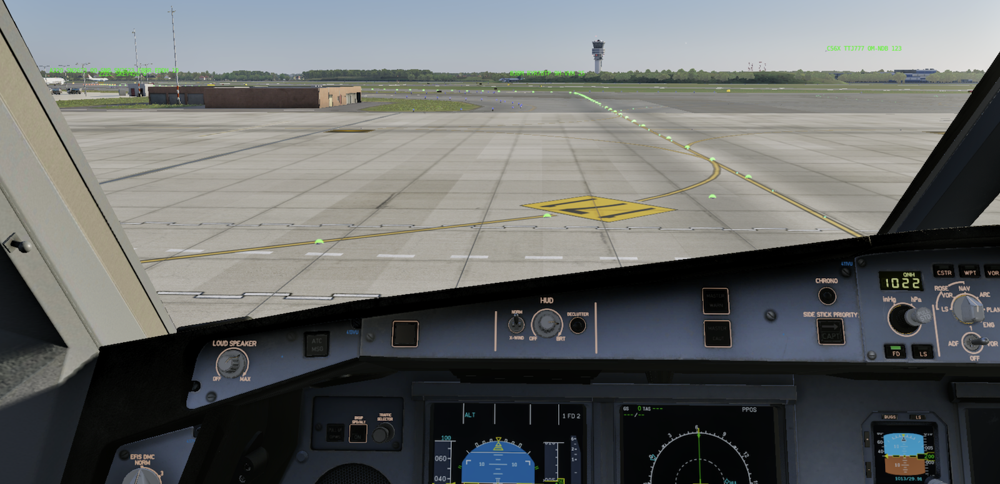
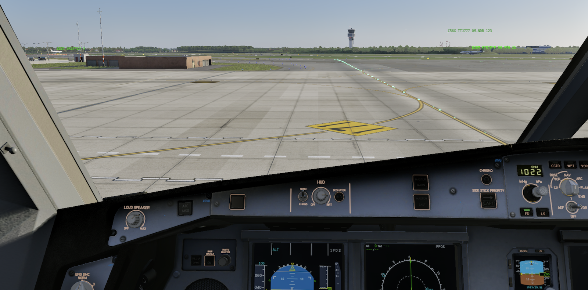
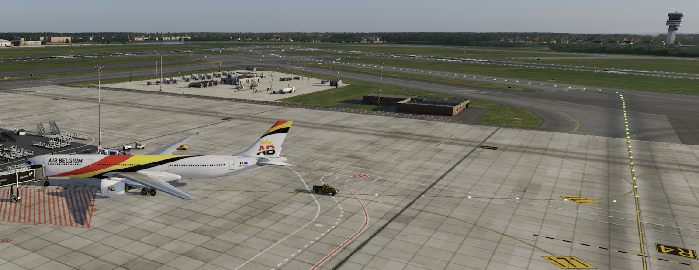
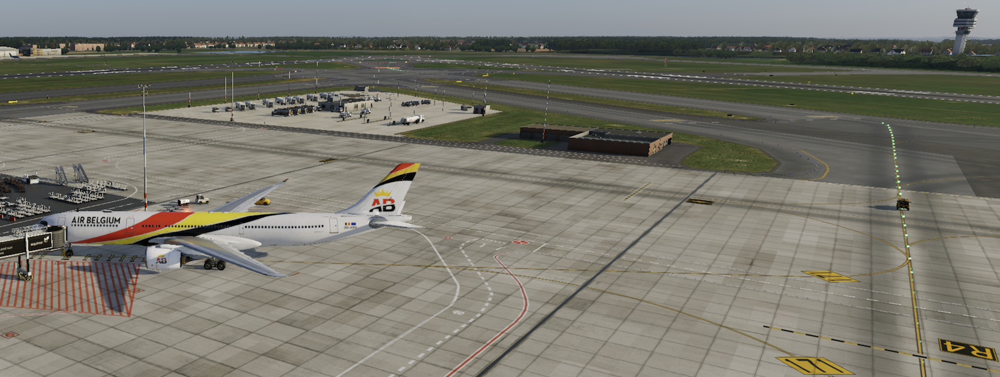

# Preferences

Follow the greens has an optional sophisticated preference file
where numerous options and features can be specified.

## Preference File Location

Preferences are loaded each time a new FtG guidance session is started.

The preference file is located in:

`<X-Plane 12 Folder> / Output / preferences / followthegreens.prf`

It is the same file for Follow the greens and Follow Me Car preferences.

If the file is not found, there won't be any preference set up.
FtG will create an empty file at that location for later use.

If a preference file is found, loaded preferences are logged in the ftg_log.txt file.
It is then easy to control which values are being used in the application.


## Preference File Structure

The preference file is a [TOML](https://toml.io/en/) formatted file (_A config file format for humans._),
even if its extension is prf to adhere to X-Plane standards.


## Preference Hierarchy

Follow the greens preferences have a hierarchical structure.

Options can be set for the entire applications,

```
# GLOBAL OPTION
#
LOGGING_LEVEL = 10
```

but can also be restricted to a single airport or a single aircraft type.

```
[Airports.EBBR]
DISTANCE_BETWEEN_GREEN_LIGHTS = 8.0
USE_THRESHOLD = true
```

```
[Aircrafts.A21N]
VISUAL_RANGE.RANGE = [40, 80]
VISUAL_RANGE.LIMITS = [40, 150]
```

In TOML vocabulary, sections between brackets like `[Aircrafts.A21N]` are called _tables_.
Period `.` is used as a domain separator.
`[Aircrafts.A21N]` is table `[A21N]` inside table `[Aircrafts]`.
Preferences listed directly under the `[Aircrafts.A21N]` only apply _inside_ that domain.


# General Preferences

The following preferences can be set different levels, _top_ level included.
Defining a preference at the top-level means that the preference
applies to the entire application unless an airport- or aircraft-specific
preference redefines it.

1. `LOGGING_LEVEL`: Controls the amount of information that is written into Follow the greens log file. The lower the level, the more information gets written.
1. `DISTANCE_BETWEEN_GREEN_LIGHTS`: Distance between taxiway center lights (expressed in meters.)
1. `RABBIT_SPEED`: Rabbit speed, including completely disabled by setting the speed to `0`. (Expressed in fraction of a second; would be the same for all aicrafts.)
1. `RABBIT_LENGTH`: Rabbit length (would be the same for all aicrafts.)
1. `LIGHTS_AHEAD`: Number of lights lit ahead of the rabbit. 0 light means all lights are lit.
1. `DISTANCE_BETWEEN_LIGHTS`: Distance between lights when illuminating the whole taxiway network (Show taxiway, expressed in meters.).
1. `DISTANCE_BETWEEN_STOPLIGHTS` (in meters, a small distance like 1 (dense) to 3 (loose) meters.)
1. `ADD_WIGWAG`: Adds a «wigwag» light on the side of stop bar if the stop bar is guarding a runway.
1. `USE_THRESHOLD`: Boolean true/false. Use runway threshold if available rather than runway edge. A fictional threshold is added about 200m inside the runway if no threshold distance is available for the runway.


# Preferences for Airports

The following preferences can be specified (and redefined) at the airport-level:
1. `DISTANCE_BETWEEN_GREEN_LIGHTS`
1. `RABBIT_SPEED`
1. `RABBIT_LENGTH`
1. `LIGHTS_AHEAD`
1. `DISTANCE_BETWEEN_LIGHTS`
1. `USE_THRESHOLD`

Example:

```
[Airports.EBBR]
USE_THRESHOLD = true
```

Please note boolean value need to be exactly key word `true` or `false`, in lower case.
All other values will be ignored and my cause the preference file not being loaded.


# Preferences for Aircrafts

The following preferences can be specified (and redefined) at the aircraft _class_ (`A` to `F`) or aircraft type level:

1. `RABBIT_SPEED`
1. `RABBIT_LENGTH`
1. `LIGHTS_AHEAD`
1. `VISUAL_RANGE.RANGE`: Approximate minimal and maximal distance for car in front of aircraft.
1. `VISUAL_RANGE.LIMITS`: Minimal and maximal distance for car in front of aircraft.

Example:

```
[Aircrafts.C]
VISUAL_RANGE.RANGE = [40, 80]  # in meters
```

# Preferences for Follow the greens

The following preferences are specific to Follow the greens:

1. `DISTANCE_BETWEEN_GREEN_LIGHTS`
1. `RABBIT_SPEED`
1. `RABBIT_LENGTH`
1. `LIGHTS_AHEAD`
1. `DISTANCE_BETWEEN_LIGHTS`


## Lights

### Meaning of Lights

FtG lights different _types of lights_ at precise locations.
You can adjust some of the light parameters to change the size, color, and intensity of each _type of light_.

The different types of lights are:

- `FIRST`: First light of follow the greens.
- `TAXIWAY`: Regular "green" taxiway light used for the path and the "rabbit".
- `TAXIWAY_ALT`: On runway lead-on and lead-off, same as TAXIWAY light but yellow/amber.
- `STOP`: Lights used to build the stop bar across the taxiway when clearance is requested (same as TAXIWAY light but red.).
- `VERTEX`: Additional light added at taxiway network vertex, as published in the airport data file. Used for development mainly.
- `WARNING`: Additional light, no longer used, a yellow taxiway light.
- `LAST`: Last light of follow the greens.
- `ACTIVE`: Light on a departure, arrival or ILS active segment.
- `DEFAULT`: Light used by Show Taxiway to illuminate all taxiways, default to a bright white light.

To change lights parameters for a type of light, insert the following preference:

```
[Lights.TAXIWAY_ALT]
color = [1.0, 1.0, 0.0]  # (r, g, b), values in [0, 1] range
intensity = 20  # default value
size = 20  # default value
```

This would change the `TAXIWAY_ALT` light type to a bright yellow light.
(The above preference will effectively _create_ a new light with a _random name_ with the supplied paramters and load it.)


### Type of Lights

FtG uses two types of light:
1. default omni directional light
1. realistic taxiway light

The *default light* is a simple, spheric, omni directional light.
It can be configured using the parameters:

- Color
- Size
- Intensity
- Optional file name (if not specified, a random file name will be generated)

To create a normal, default light with specific color, size and intensity,
you can use the code snippet above.

The light is bulbuous, bright, and can be seen in most condition.
It does not appear or look natural but is always highly visible.


The *realistic light* is a more complex light that has the appearance and behavior of common taxiway lights.
Light is directional, aligned with the taxiway, and can only be seen when facing it.
It is more realistic, at the expense of being more difficult to see if not properly aligned.
The standard realistic light has twice the brightness of a regular taxiway light
and stand out in both daylight and night lights.




On the above pictures, please notice how lights are visible or not,
as seen sideway, on the forefront or after the first turn.

Realistic lights only have two parameters:

- Color, which must by a code g (green), r (red), y (yellow/amber), as provided by X-Plane, no other color possible.
- Intensity, an integer number that replicate the same light at the same position making it brighter.

The intensity is therefore a integer number that tells how many copies of the light must be placed.

To create a realistic light, you can use the following snippet:

```
[Lights.TAXIWAY_ALT]
taxiway = "r:2"
```

would create a realistic taxiway RED light with double (`2`) light intensity.


Note that FtG lights, standard or realistic,
are NOT affected by the `sim/graphics/scenery/airport_light_level` dataref
that sets the overall intensity of runway lights.





### Alternate Light Object File

To use another object light, you must use the following syntax:

```
Lights.TAXIWAY_ALT = "path/to/personal-object-light.obj"
```

Please note that it is not the same as

```
[Lights.TAXIWAY_ALT]
name = "path/to/personal-object-light.obj"
```

which would _create_ a file named `path/to/personal-object-light.obj`
with default custom light values (color=white, intensity=20, size=20)
as explained above.

Path objects for lights are relative to the `followthegreens / lights` folder.


### Taxiway Light Objects

The above light _objects_ are *lights*, i.e. surfaces that _emit_ a 3D light.
They have no 3D object representing them on the screen on a rendering.
They are just *lights*.

There is an extra light type

- `OFF`: Physical taxiway light object with no light (light off).

This is an object that represents a physical taxiway light.
That object emits no light at all, it is just decorative.

If you wish to replace it with an alternate light object:

```
Lights.OFF = "path/to/favourite-taxiway-light.obj"
```


# Preferences for Follow Me Car

If a Follow Me Car is defined in the preference file,
it is used if the user select the car model `Preference`.


## Follow Me Car Alternative

To use an alternative follow me car or to change properties
of a follow me car provided by Follow the greens,
the following snippet must be used:

```
[FollowMeCar]
filename = "xcsl/FMC.obj"  # or "custom/my_own_fm_van.obj"
slow_speed = 3.0  # all speed m/s, for turns, careful move, slow move
normal_speed = 7.0  # ~ 25km/h, normal travel speed
leave_speed = 10.0  # expedite speed to leave/clear an area
fast_speed = 14.0  # running fast to a destination far away
max_speed = 18.0
turn_radius = 25.0  # m
acceleration = 1.0  # m/s^2
deceleration = -1.0  # m/s^2
```

`filename` can either be an existing Follow Me Car object
or a user-supplied alternate object.
Path objects are relative to the `followthegreens / cars` folder.


## Follow Me Car Indicator

The _Indicator_ is a signboard on top of the car that can displays 4 messages:
- Follow Me
- Turn Left
- Turn Right
- Stop

It is an _autonomous object_ that can be used independently of the follow me car,
or added to any follow me car object.

To add the indicator object to one of the two Follow Me Cars provided by Follow the greens,
you just need to check the appropriate option in the main window.

If you provide you own follow me car object, you can add the Indicator on top of your car.
To do so, in the TOML table that describe the car in the preference file,
you need to add the following preferences:

```
[FollowMeCar]
filename = "xcsl/FMC.obj"
indicator = true
indicator_shift = [2.02, -1.8]  # in meters [+above center of car, +forward center of car]
indicator_warning_distance: float = 50.0  # m, warns that many meters before the turn/stop.
```

`ìndicator_shift` is the location of the center of the Indicator object relative
to the center of the follow me car object.
In the above case, it is 2.02 meters above the center of the car, 1.8 meters
behind (towards the back) the center of the car.

Technically speaking, the indicator shift will be moved along with the car
as a separate object.
However, it will be animated and display its messages when needed.

Indicator is better used with smaller aircraft, where the car remains
at smaller distance from the aircraft.

For a A380, where the car runs a few hundred meters in front of the car
you need good eyes to read the signboard.